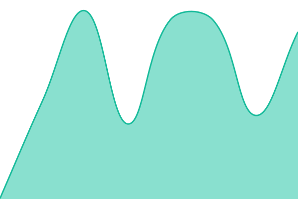
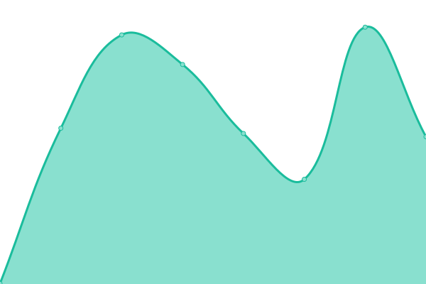
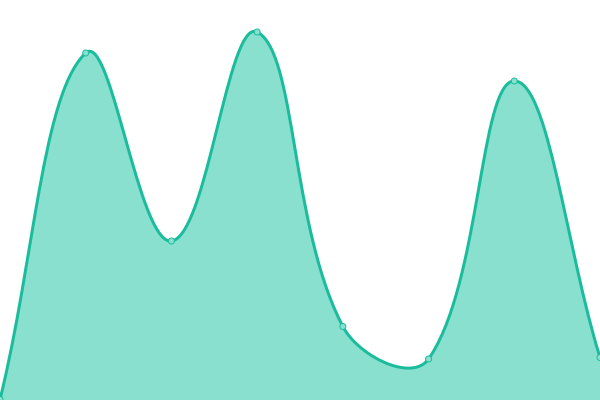

# [📈 Live Status](https://Manu-Devloo.github.io/upptime): <!--live status--> **🟧 Partial outage**

This repository contains the open-source uptime monitor and status page for [Manu Devloo](www.manudevloo.com), powered by [Upptime](https://github.com/upptime/upptime).

With [Upptime](https://upptime.js.org), you can get your own unlimited and free uptime monitor and status page, powered entirely by a GitHub repository. We use [Issues](https://github.com/Manu-Devloo/upptime/issues) as incident reports, [Actions](https://github.com/Manu-Devloo/upptime/actions) as uptime monitors, and [Pages](https://Manu-Devloo.github.io/upptime) for the status page.

<!--start: status pages-->
<!-- This summary is generated by Upptime (https://github.com/upptime/upptime) -->
<!-- Do not edit this manually, your changes will be overwritten -->
<!-- prettier-ignore -->
| URL | Status | History | Response Time | Uptime |
| --- | ------ | ------- | ------------- | ------ |
|  [Personal site](https://www.manudevloo.com) | 🟩 Up | [personal-site.yml](https://github.com/Manu-Devloo/upptime/commits/HEAD/history/personal-site.yml) | 

 3875ms
     
 | 

<a href="https://uptime.manudevloo.com/history/personal-site">100.00%</a>
    

|  [Immich](https://immich.manudevloo.com) | 🟩 Up | [immich.yml](https://github.com/Manu-Devloo/upptime/commits/HEAD/history/immich.yml) | 

 464ms
     
 | 

<a href="https://uptime.manudevloo.com/history/immich">100.00%</a>
    

|  [Nextcloud](https://nextcloud.manudevloo.com) | 🟩 Up | [nextcloud.yml](https://github.com/Manu-Devloo/upptime/commits/HEAD/history/nextcloud.yml) | 

 927ms
     
 | 

<a href="https://uptime.manudevloo.com/history/nextcloud">100.00%</a>
    

|  [Overseer](https://request.manudevloo.com) | 🟩 Up | [overseer.yml](https://github.com/Manu-Devloo/upptime/commits/HEAD/history/overseer.yml) | 

 1310ms
     
 | 

<a href="https://uptime.manudevloo.com/history/overseer">99.53%</a>
    

|  [QBittorrent](https://torrent.manudevloo.com) | 🟩 Up | [q-bittorrent.yml](https://github.com/Manu-Devloo/upptime/commits/HEAD/history/q-bittorrent.yml) | 

 466ms
     
 | 

<a href="https://uptime.manudevloo.com/history/q-bittorrent">100.00%</a>
    

|  [Open webui](https://chat.manudevloo.com) | 🟩 Up | [open-webui.yml](https://github.com/Manu-Devloo/upptime/commits/HEAD/history/open-webui.yml) | 

 439ms
     
 | 

<a href="https://uptime.manudevloo.com/history/open-webui">100.00%</a>
    

|  [Books](https://books.manudevloo.com) | 🟥 Down | [books.yml](https://github.com/Manu-Devloo/upptime/commits/HEAD/history/books.yml) | 

 459ms
     
 | 

<a href="https://uptime.manudevloo.com/history/books">0.00%</a>
    

|  [File manager](https://file.manudevloo.com) | 🟥 Down | [file-manager.yml](https://github.com/Manu-Devloo/upptime/commits/HEAD/history/file-manager.yml) | 

 427ms
     
 | 

<a href="https://uptime.manudevloo.com/history/file-manager">0.00%</a>
    

|  [Dashboard](https://flame.manudevloo.com) | 🟥 Down | [dashboard.yml](https://github.com/Manu-Devloo/upptime/commits/HEAD/history/dashboard.yml) | 

 0ms
     
 | 

<a href="https://uptime.manudevloo.com/history/dashboard">0.00%</a>
    

|  [Plex](https://plex.manudevloo.com) | 🟥 Down | [plex.yml](https://github.com/Manu-Devloo/upptime/commits/HEAD/history/plex.yml) | 

 0ms
     
 | 

<a href="https://uptime.manudevloo.com/history/plex">0.00%</a>
    

|  [Github](https://www.github.com) | 🟩 Up | [github.yml](https://github.com/Manu-Devloo/upptime/commits/HEAD/history/github.yml) | 

 208ms
     
 | 

<a href="https://uptime.manudevloo.com/history/github">99.74%</a>
    

<!--end: status pages-->

[**Visit our status website →**](https://Manu-Devloo.github.io/upptime)

## 📄 License

- Powered by: [Upptime](https://github.com/upptime/upptime)
- Code: [MIT](./LICENSE) © [Anand Chowdhary](https://anandchowdhary.com), supported by [Pabio](https://pabio.com)
- Data in the `./history` directory: [Open Database License](https://opendatacommons.org/licenses/odbl/1-0/)
